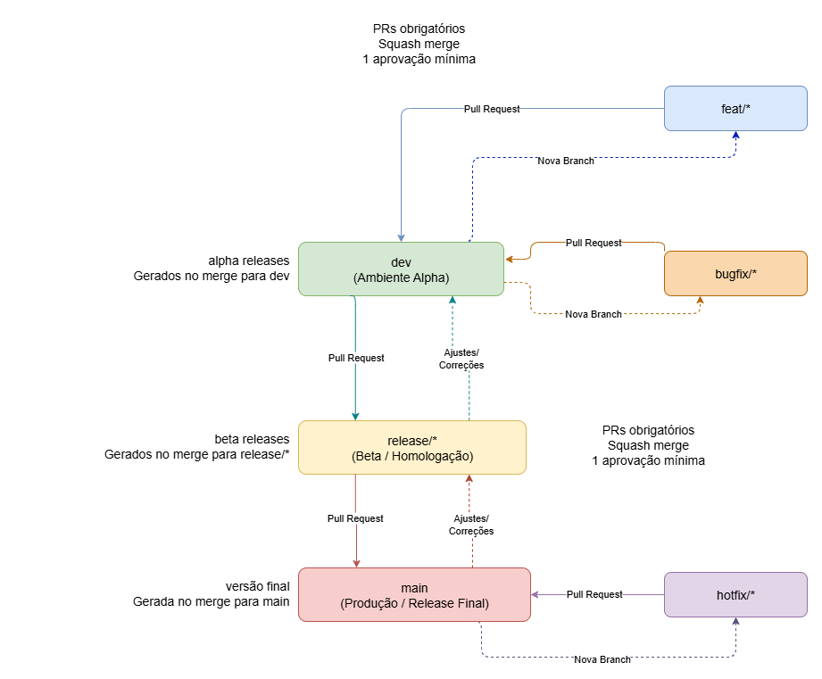

# Processo de Entrega e Governança de Versionamento

Este pacote padroniza o processo de desenvolvimento, versionamento semântico, criação de releases e fluxo de aprovação.
Inclui templates e ações automatizadas para o ciclo Alpha, Beta e Release.



## Aplicando políticas de proteção de branch

### Aplicando políticas via GitHub CLI

Utilize os arquivos de configuração localizados em `.github/branch-protection-policies/` como payload:

```sh
# Proteção para a branch main
gh api repos/OWNER/REPO/branches/main/protection --method PUT --input .github/branch-protection-policies/branch-protection-main.json

# Proteção para a branch dev
gh api repos/OWNER/REPO/branches/dev/protection --method PUT --input .github/branch-protection-policies/branch-protection-dev.json
```

### Aplicando políticas via GitHub API (curl)

Também é possível aplicar as políticas usando curl e os arquivos JSON:

```sh
# Proteção para a branch main
curl -X PUT -H "Authorization: Bearer TOKEN" -H "Accept: application/vnd.github+json" \
  https://api.github.com/repos/OWNER/REPO/branches/main/protection \
  --data-binary @.github/branch-protection-policies/branch-protection-main.json

# Proteção para a branch dev
curl -X PUT -H "Authorization: Bearer TOKEN" -H "Accept: application/vnd.github+json" \
  https://api.github.com/repos/OWNER/REPO/branches/dev/protection \
  --data-binary @.github/branch-protection-policies/branch-protection-dev.json
```

## Times sugeridos

Durante a etapa de configuração do repositório, é recomendado criar os seguintes times:

### Criando times via GitHub CLI

Execute os comandos abaixo, substituindo `ORG` pelo nome da sua organização:

```sh
gh api orgs/ORG/teams -f name='dev-frontend'
gh api orgs/ORG/teams -f name='dev-backend'
gh api orgs/ORG/teams -f name='dev-seniors'
```

### Criando times via GitHub API (curl)

Substitua `ORG` pelo nome da sua organização e `TOKEN` por um token de acesso com permissão de admin:

```sh
curl -X POST -H "Authorization: Bearer TOKEN" -H "Accept: application/vnd.github+json" \
	https://api.github.com/orgs/ORG/teams \
	-d '{"name": "dev-frontend"}'
curl -X POST -H "Authorization: Bearer TOKEN" -H "Accept: application/vnd.github+json" \
	https://api.github.com/orgs/ORG/teams \
	-d '{"name": "dev-backend"}'
curl -X POST -H "Authorization: Bearer TOKEN" -H "Accept: application/vnd.github+json" \
	https://api.github.com/orgs/ORG/teams \
	-d '{"name": "dev-seniors"}'
```

## Labels sugeridas

As labels abaixo tem como objetivo organizar e definir responsáveis de forma automática para as pull requests e issues.

### Labels automáticas utilizadas

As labels abaixo são aplicadas automaticamente conforme o arquivo `.github/labeler.yml`:

```plaintext
frontend
backend
docs
release
team-dev-seniors
type-bug
type-ci
```

### Criando labels via GitHub CLI

Execute os comandos abaixo, substituindo `OWNER/REPO` pelo repositório desejado:

```sh
gh label create "frontend" --color "1D76DB" --description "Mudanças no frontend" --repo OWNER/REPO
gh label create "backend" --color "D73A4A" --description "Mudanças no backend" --repo OWNER/REPO
gh label create "docs" --color "0075CA" --description "Documentação" --repo OWNER/REPO
gh label create "release" --color "FBCA04" --description "Release" --repo OWNER/REPO
gh label create "team-dev-seniors" --color "F9D0C4" --description "Time Seniors/Infraestrutura" --repo OWNER/REPO
gh label create "type-bug" --color "B60205" --description "Bug detectado" --repo OWNER/REPO
gh label create "type-ci" --color "A2EEEF" --description "Mudanças de CI" --repo OWNER/REPO
```

### Criando labels via GitHub API (curl)

Substitua `OWNER`, `REPO` e `TOKEN` conforme necessário:

```sh
curl -X POST -H "Authorization: Bearer TOKEN" -H "Accept: application/vnd.github+json" \
  https://api.github.com/repos/OWNER/REPO/labels \
  -d '{"name": "frontend", "color": "1D76DB", "description": "Mudanças no frontend"}'
curl -X POST -H "Authorization: Bearer TOKEN" -H "Accept: application/vnd.github+json" \
  https://api.github.com/repos/OWNER/REPO/labels \
  -d '{"name": "backend", "color": "D73A4A", "description": "Mudanças no backend"}'
curl -X POST -H "Authorization: Bearer TOKEN" -H "Accept: application/vnd.github+json" \
  https://api.github.com/repos/OWNER/REPO/labels \
  -d '{"name": "docs", "color": "0075CA", "description": "Documentação"}'
curl -X POST -H "Authorization: Bearer TOKEN" -H "Accept: application/vnd.github+json" \
  https://api.github.com/repos/OWNER/REPO/labels \
  -d '{"name": "release", "color": "FBCA04", "description": "Release"}'
curl -X POST -H "Authorization: Bearer TOKEN" -H "Accept: application/vnd.github+json" \
  https://api.github.com/repos/OWNER/REPO/labels \
  -d '{"name": "team-dev-seniors", "color": "F9D0C4", "description": "Time Seniors/Infraestrutura"}'
curl -X POST -H "Authorization: Bearer TOKEN" -H "Accept: application/vnd.github+json" \
  https://api.github.com/repos/OWNER/REPO/labels \
  -d '{"name": "type-bug", "color": "B60205", "description": "Bug detectado"}'
curl -X POST -H "Authorization: Bearer TOKEN" -H "Accept: application/vnd.github+json" \
  https://api.github.com/repos/OWNER/REPO/labels \
  -d '{"name": "type-ci", "color": "A2EEEF", "description": "Mudanças de CI"}'
```
